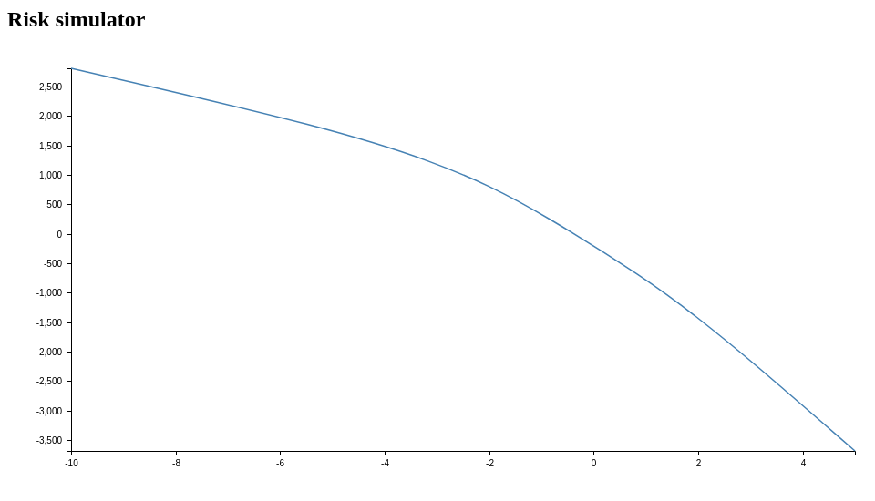

# Tastyworks risk simulator

Test the max upside and potential drawdowns of your Tastyworks account for a certain percentage change in the SPY.

The software will give you the estimated upside or drawdown by forecasting option prices (using Black Scholes formula) for your current positions according to their SPY beta weight.

## Example output

```
{
  "ZM": {
    "beta": 1,
    "changePercentageInSPY": -1,
    "betaWeightedChange": -1,
    "positions": {
     "ZM    200117P00075000": {
      "direction": "Short",
      "quantity": 3,
      "currentPrice": 7,
      "simulatedPrice": 8.048063708964378,
      "currentValue": -2100,
      "simulatedValue": -2414.4191126893134,
      "pl": -314.41911268931335
     }
    },
    "pl": -314.41911268931335
  }
}
...
```

## Chart:



## Install and run

Install the dependencies and set the tastyworks account details in the shell environment:

```
  yarn
  export TW_USER=<your user>; export TW_PASSWORD=<your password>; export TW_ACCOUNT_ID=<your account>
```

Now run the simulation or create a chart witht the estimated max drawdown and upside:

```
  node example/index.js
  node example/chart.js
```

## Next

- Move to Typescript in the next chance I have.